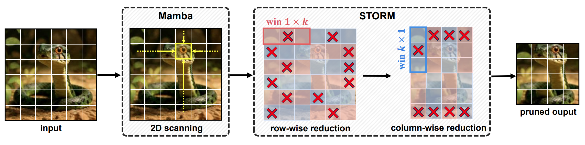
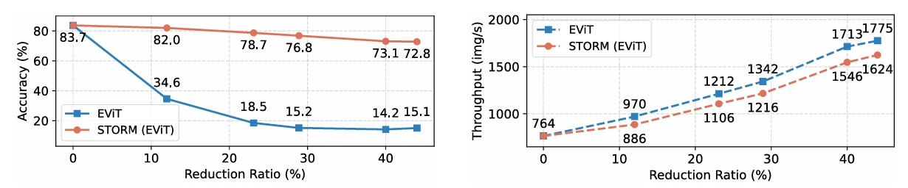
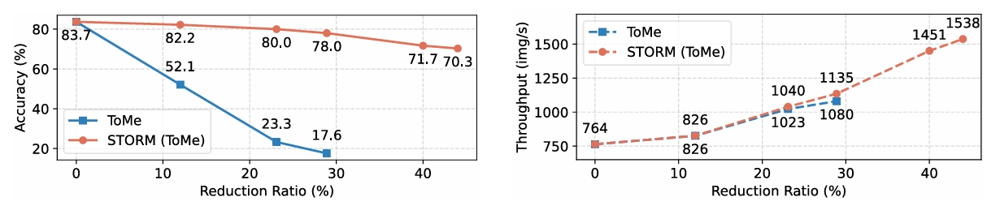
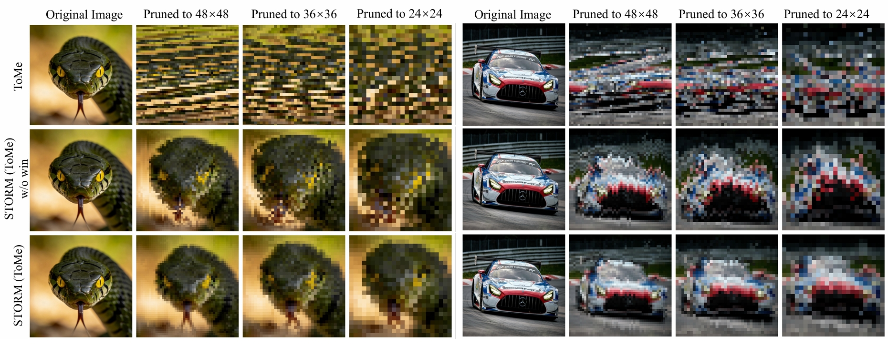

# 🌪️ STORM: Spatial-Aware Reduction Framework: Towards  Efficient and Faithful  Visual State Space Models
<p>
  <a href="http://arxiv.org/abs/2512.01485">
    
  </a>
<a href="https://multi-path-collaborative-reasoning.github.io/">
    
  </a>
</p>

This is the official implementation of the paper: [Spatial-Aware Reduction Framework: Towards  Efficient and Faithful  Visual State Space Models.](http://arxiv.org/abs/2512.01485)


## 📋 Table of Contents
- [Overview](#-overview)
- [Results](#-results-on-imagenet-1k)
- [Visualization](#-visualization)
- [Installation](#-installation)
- [Usage](#-usage)
- [Acknowledgements](#-acknowledgements)
- [Citation](#-citation)


## 🔍 Overview

<div align="center">


<p><em>Overview of STORM. The framework performs spatially structured token reduction in two decoupled stages: row-wise and then column-wise reduction within localized windows, preserving the 2D grid layout required for selective scanning.</em></p>

</div>
The STORM framework proposes a lightweight solution that refactors token reduction into a spatially structured process, as illustrated in Figure 3 above. The framework comprises three core features:

1.  **Dimensional Decoupling:** Instead of globally flattening tokens, STORM refactors the reduction process into two successive stages—row-wise and column-wise. This preserves a regular 2D grid topology, ensuring seamless compatibility with the 2D Selective Scan (SS2D) mechanism in Mamba.
2.  **Localized Window:** To prevent semantic distortion from long-range interference, STORM partitions the feature map into non-overlapping local windows. Reduction operations are strictly confined within these contiguous neighborhoods to protect fine-grained details and local coherence.
3.  **Faithful Scanning Restoration:** By maintaining a structured layout, STORM ensures that the causal propagation paths of the four-way scanning are not disrupted. This allows the model to retain accurate spatial awareness and performance during inference without requiring any re-training.

For detailed algorithmic descriptions and ablation studies, please refer to Section 3 of our [paper](link-to-paper).
<!-- <div align="justify">

The STORM framework proposes a lightweight solution that refactors token reduction into a spatially structured process, as illustrated in Figure 3 above. The framework comprises three core features:

1.  **Dimensional Decoupling:** Instead of globally flattening tokens, STORM refactors the reduction process into two successive stages—row-wise and column-wise. This preserves a regular 2D grid topology, ensuring seamless compatibility with the 2D Selective Scan (SS2D) mechanism in Mamba.
2.  **Localized Window:** To prevent semantic distortion from long-range interference, STORM partitions the feature map into non-overlapping local windows. Reduction operations are strictly confined within these contiguous neighborhoods to protect fine-grained details and local coherence.
3.  **Faithful Scanning Restoration:** By maintaining a structured layout, STORM ensures that the causal propagation paths of the four-way scanning are not disrupted. This allows the model to retain accurate spatial awareness and performance during inference without requiring any re-training.

For detailed algorithmic descriptions and ablation studies, please refer to Section 3 of our [paper](link-to-paper).

</div> -->

> **Abstract:** Mamba demonstrates strong efficiency in modeling long visual sequences. However, when token reduction is applied to structurally enhanced Mamba variants, these models exhibit a severe performance collapse. We attribute this degradation to the spatially agnostic nature of existing reduction methods, which violate the two-dimensional structural premise required by the selective scanning mechanism. In this work, we propose STORM, a spatial-aware token reduction framework designed to maintain structural integrity throughout the compression process. STORM reformulates reduction into a structured operation on spatial units, enforcing localized constraints to maintain both grid topology and neighborhood coherence. As a plug-and-play module, STORM equips existing reduction pipelines with explicit spatial awareness without any training. Empirical results demonstrate that STORM achieves state-of-the-art pruning accuracy across diverse vision Mamba backbones under training-free settings. Notably, STORM delivers a substantial accuracy recovery on VMamba, outperforming prior methods by up to 63.3% in top-1 accuracy. Meanwhile, STORM incurs only a 1.0% accuracy drop on PlainMamba, achieving performance comparable to ViT.

## 📊 Results on ImageNet-1K

<div align="justify">



**Figure 1:** Accuracy and throughput comparison between EViT and STORM (EViT) under different reduction ratios. STORM maintains high accuracy while significantly improving inference speed.



**Figure 2:** Accuracy and throughput comparison between ToMe and STORM (ToMe) across varying reduction ratios. STORM achieves better performance retention with higher throughput.

</div>

## 🖼️ Visualization



**Figure 3:** Visualization of token reduction at varying compression ratios. ToMe produces fragmented and spatially inconsistent representations. Structured spatial reduction (without windowing) restores layout regularity but sacrifices fine-grained details. In contrast, the full STORM framework consistently preserves both structural integrity and semantic coherence across all pruning levels.

")

**Figure 3:** Visualization of extreme token reduction with STORM (ToMe). The figure illustrates the merging results on ImageNet-1K validation images when tokens are aggressively pruned from 26×26 to 6×6 (approximately 95% token reduction). Patches sharing the
same color are merged into a single token, demonstrating how STORM preserves structural groups even under extreme compression.

## 🛠 Installation

First, clone the repository to your local machine:

```bash
git clone https://github.com/AOLIAO12312/STORM
cd STORM
```

### 🐍 VMamba: Visual State Space Model

It is highly recommended to use a **CUDA 12** compatible environment.

```bash
# Create and activate the environment
conda create -n vmamba python=3.10 -y
conda activate vmamba

# Install core dependencies
pip install torch==2.2 torchvision torchaudio triton pytest chardet yacs termcolor fvcore seaborn packaging ninja einops 
pip install numpy==1.24.4 timm==0.4.12

# Install Mamba SSM (Pre-compiled optimized kernels)
pip install https://github.com/state-spaces/mamba/releases/download/v2.2.4/mamba_ssm-2.2.4+cu12torch2.2cxx11abiTRUE-cp310-cp310-linux_x86_64.whl
```

### 📍 LocalMamba: Localized Scan Strategy

```bash
cd localmamba/
conda create -n localmamba python=3.10 -y
conda activate localmamba

pip install torch==2.1 torchvision torchaudio
cd causual-conv1d && pip install .
cd ..
cd mamba-1p1p1 && pip install .
cd ..
```

### 🧊 PlainMamba: Simplified Architecture

Best suited for **PyTorch 1.13.1**. If you encounter CUDA linking errors, try installing `cudatoolkit-dev`.

```bash
cd plainmamba/
conda create -n plainmamba python=3.10 -y
source activate plainmamba
pip install torch==1.13.1+cu116 torchvision==0.14.1+cu116 -f https://download.pytorch.org/whl/torch_stable.html --no-cache
conda install -c conda-forge cudatoolkit-dev # Optional, only needed when facing cuda errors
pip install -U openmim
mim install mmcv-full
pip install mamba-ssm
pip install mlflow fvcore timm lmdb
pip install -e .
```

---

## 🚀 Usage

### 🐍 VMamba

Navigate to the project root and execute the inference script:

```bash
# Navigate to the project root
cd vmamba/

# Execute inference script
./run_vmamba.sh \
  --data-path /path/to/data \
  --cfg /path/to/config \
  --pretrained /path/to/checkpoint \
  --batch-size 128 \
  --output /path/to/output \
  --throughput
```

### 📍 LocalMamba

Navigate to the classification directory and execute the script:

```bash
# Go to the classification dir
cd localmamba/classification/

# Execute inference script
./run_localmamba.sh \
  --cfg configs/strategies/local_mamba/config.yaml \  # Path to config
  --model timm_local_vssm_small \                   # Model architecture
  --resume /path/to/weights.ckpt \                  # Pretrained checkpoint
  --data-path /path/to/imagenet \                   # Dataset root
  --gpus 4 \                                        # Number of GPUs
  --drop-path 0.1 \                                 # Drop path rate
  --exp local_mamba_eval                            # Experiment name
```

### 🧊 PlainMamba

Execute the inference script using the following example:

```bash
cd plainmamba/

# Execute inference script
./run_plainmamba.sh \
  --cfg plain_mamba_configs/plain_mamba_l2_in1k_300e.py \  # Path to config
  --checkpoint /path/to/l2.pth \                         # Pretrained weights
  --gpus 1 \                                             # Number of GPUs
  --port 29503                                           # Distributed port
```

## 🤝 Acknowledgements

The repo is partly built based on [VMamba](https://github.com/MzeroMiko/VMamba) 🐍, [LocalMamba](https://github.com/hunto/LocalMamba) 📍, and [PlainMamba](https://github.com/ChenhongyiYang/PlainMamba) 🧊. We are grateful for their generous contributions to open source. 🌟


## 📝 Citation

If you find our work useful in your research, please consider citing our paper:

```bibtex
@article{liu2025storm,
  title={STORM: Spatial-Aware Token Reduction Framework for VSSM},
  author={Liu, Yue and Tian, Yunjie and Zhao, Yuzhong and Yu, Hongtian and Xie, Lingxi and Wang, Yaowei and Ye, Qixiang and Liu, Yunfan},
  journal={arXiv preprint arXiv:xxxx.xxxxx},
  year={2025}
}
```
